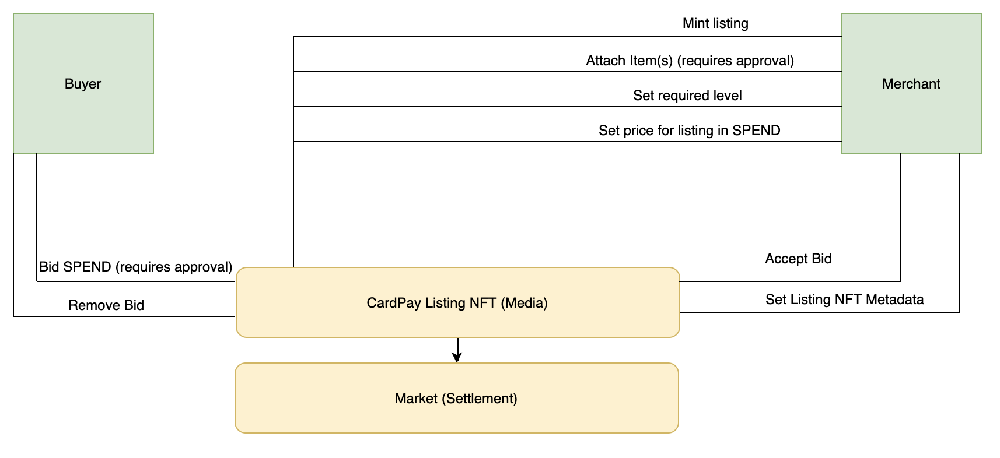
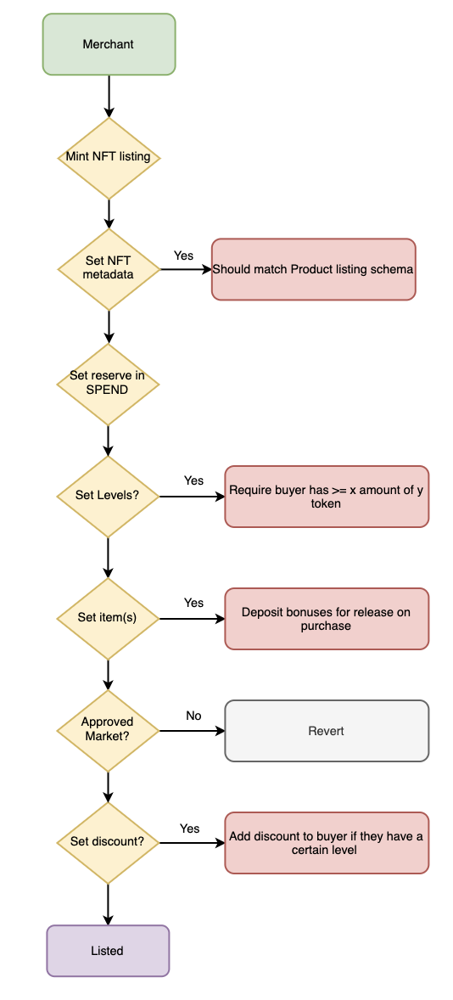
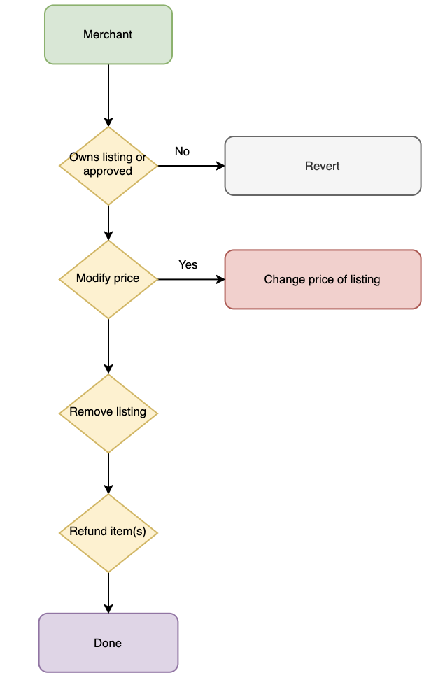

# CardPay-contracts

## Description

CardPay is a social commerce platform that leverages EVM based blockchains to provide a marketplace for merchants and buyers to purchase digital items using cryptocurrency and fiat.

## Getting started

### install dependencies

`$ yarn`

### compile the contracts

`$ yarn build`

### run a local blockchain (required for testing)

`$ yarn chain`

### run tests

`$ yarn test`

## Contracts

- `MarketPlace.sol` - the contract that facilitates buying and selling of listings on the platform
- `Media.sol` - an ERC721 compliant contract that mints the listing NFTs and proxies calls to the market place

## Token standards used

- `ERC721` for NFTs, including listings and items
- `ERC20/ERC667` for all fungible tokens including items, SPEND & levels

## Assumptions

- These contracts will run on the xDAI chain, each asset used may or may not be pegged to a mainnet balance
- Prices are denominated in SPEND, a fungible token
- All user funds will be held in gnosis safes
- Gnosis safe infrastructure handles all the relaying RE gas fees
- the NFTs minted for listings will be contained in the CardPay NFT contract
- Each listing corresponds to a unique NFT but can represent fungibles and/or other NFT(s)
- Listings are for digital products only, no physical redemption
- Items set by the Merchant must be locked up in the contract to prevent double spending
- Items are automatically swapped on purchase
- Merchant reimburses the buyers gas fee if their bid is successful
- All NFTs are ERC721
- Listings do not expire
- “levels“ are set inside the fungible token itself so as to ensure a single source of truth set by the contract admin
- Listing prices can be changed while on the market
- Merchants can accept any bid they like, even if it is below their reserve price
- We are basing off the Zora protocol

## Architecture

This protocol extends the ERC721 standard with each listing represented by an NFT. The listing NFT itself only represents the item(s) being sold.



The following structs are used in the marketplace to facilitate the buying and selling of items on the platform:

```solidity
struct Bid {
  // Amount of the SPEND being bid
  uint256 amount;
  // token contract for bid
  address token;
  // Address of the bidder
  address bidder;
  // Address of the recipient
  address recipient;
}

struct Ask {
  // Amount of the SPEND being asked, must be in a whitelisted currency
  uint256 amount;
}

struct Items {
  // address of the merchant who has set and locked up these bonuses
  address merchant;
  // addresses of each token contract corresponding to the bonus
  address[] tokenAddresses;
  // items to send out on completion of the listing (amount or tokenId), matching the tokenAddresses index
  uint256[] amounts;
  // the quantity of these items as per the listing e.g. I am selling 10 products under the same listing NFT, requires a lockup of items * quantity
  uint256 quantity;
}

struct Discount {
  // the level requirement to be eligible for this discount
  LevelRequirement levelRequired;
  // the discount to apply as a decimal e.g. total cost * 0.9 for a 10% discount
  Decimal.D256 discount;
}

struct LevelRequirement {
  // the address of the merchant who set this level requirement
  address merchant;
  // the address of the registrar contract that records the levels
  address registrar;
  // address of the token
  address token;
  // the minimum level required to make the bid
  string levelLabel;
}

struct Level {
  // the label for the level e.g. pro
  string label;
  // the min balance required to achieve this level
  uint256 threshold;
}

struct CrossLevel {
  // the globally set level e.g. star alliance gold
  string globalLevelLabel;
  // the levels that fall under this globally set level e.g. united ruby, air NZ gold etc.
  string[] recognisedLevelsByLabel;
  // the addresses of the merchants who set the recognised levels
  address[] merchants;
  // the addresses of the tokens that the merchants set a level to
  address[] tokens;
}

```

### Mint

A merchant mints an NFT that represents the listing itself (this NFT is not the item(s) the merchant is selling, only an order id).

### Bid

Anyone can place a bid matching the listing NFT. By placing a bid, the bidder must deposit the amount denominated in SPEND. This protocol only accepts whitelisted tokens that have a corresponding rate in SPEND.

### Remove bid

A buyer can remove their bid if they change their mind, the listing is burned or another bid is successful. This will release the deposited funds back to the buyer.

### Transfer

Blocked.

### Burn

A merchant can choose to burn their listing NFT. This will refund the deposited items but the metadata and tokenId will be retained.

### Ask

A merchant can set an ask at any time. This will allow bids that match the criteria to be automatically approved. A merchant is free to modify this ask at any time. The ask is priced in SPEND and any currency that has a SPEND value can be used for fulfilling the ask.

### Accept bid

The merchant can accept any bid made by a buyer even if it doesn't meet their reserve price as set in the ask.

### Approve

The merchant can grant approval to any other address for the listing. This follows the standard ERC721 approve functionality and allows the spender to control the listing.

### Metadata for listing

A merchant can set metadata to their listing NFT. This should match a product schema defined here: https://schema.org/ProductModel

### Set item(s)

Each listing NFT on this platform is not the item(s) itself. Instead the merchant locks up these assets as items for the buyer to purchase. Each listing must have at least one item.

### Set level requirement

A merchant can set a level requirement for a listing at any time. A level corresponds to a balance of a particular token e.g. a fan token. An example of a level requirement could be that the merchant requires you hold at least 10 FAN tokens to make a bid.

### Set a discount based on a level

A merchant can set a discount based on the buyers level in a particular token. E.g. 10% off if you are a power user of RAC. This discount will be applied on the bid being accepted.

## Merchant flows

- Merchant chooses the items they wish to sell. These tokens can be either fungible or non fungible (required)
- Merchant sets a price with a reserve in SPEND (required)
- Merchant can set a discount, which is applied depending on the buyers level of fungible token holdings e.g. hold 10 RAC, get a 10% discount (optional)
- Merchant can set a required level to make a purchase, e.g. buyer must have reached VIP tier 1 (optional)
- An NFT token is minted representing the listing with a unique identifier (required)
- After listing, the Merchant can remove the listing, modify the discount based on the same levels, change the level requirement to buy or change it’s reserve price
- Merchant can accept any bid

Merchant listing flow:



Merchant modify listing flow:



Merchant bid flow:


## Buyer flows

- Buyer makes a bid or clicks buy now (must have the required balance)
- If buyer is eligible for a discount, this discount is applied on purchase
- If the buyer does not meet the level requirement for the purchase, the transaction will revert
- If successful, the buyer swaps their tokens for the item(s)

Buyer bid flow:


Buyer create bid flow:


## Attribution

This repo is based from the [Zora protocol](https://github.com/ourzora/core)
